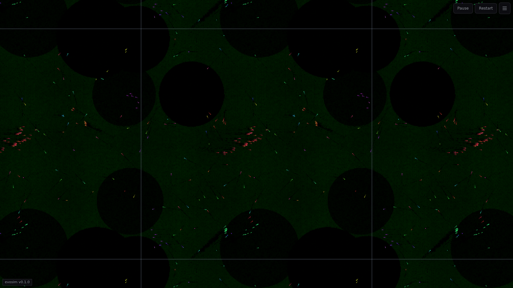
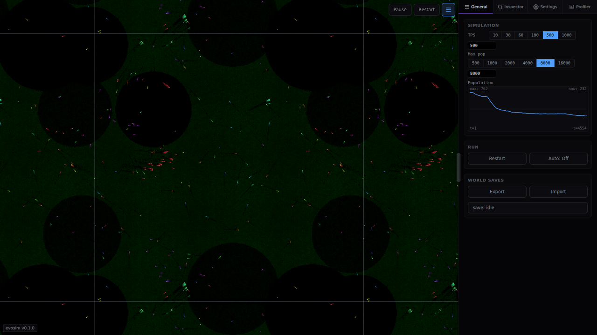
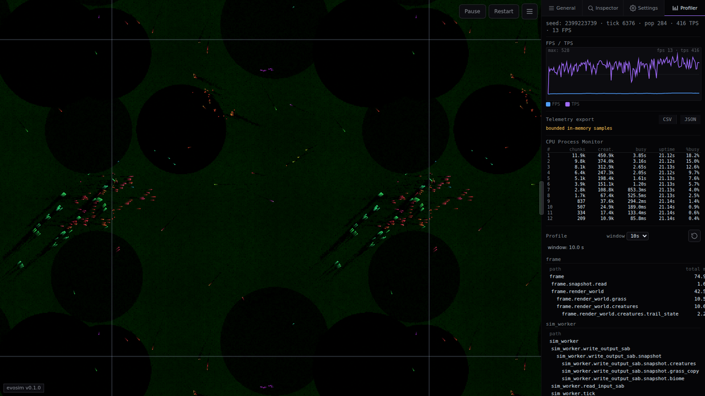
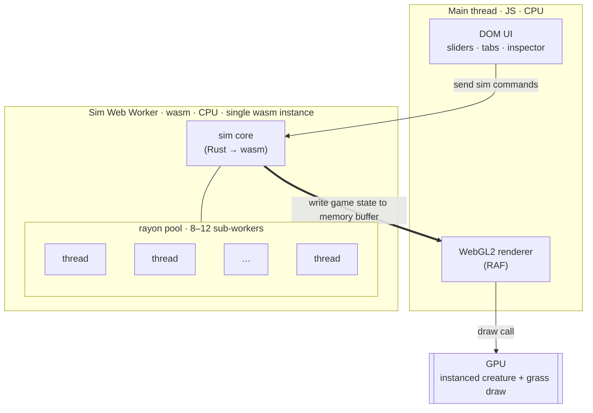

# evosim

A browser-based evolution sandbox. Tiny creatures with tiny neural-network brains live in a walled world, graze a regrowing grass field, occasionally eat each other, and split when they have enough energy. Every page reload starts a fresh world; worlds can also be exported and reimported as `.evosim.world` files. All sim and rendering runs locally in your browser — no server, no data leaves your machine.

*Live demo coming soon.*

## What you're looking at

Each dot is one creature. Color is a moving average of what it's been doing — green for grazing, red for biting prey, blue for splitting. The darker splotches underneath are grass density. The whole thing is a single world rendered in one instanced WebGL2 draw call.

Brains are a small `32 → 48 → 24 → 5` pyramid with Leaky ReLU hiddens. Inputs are semantic, not pixels: self state, a short memory vector, four wall distances, eight sectors of nearby creatures, and eight sectors of grass. The output picks one of three actions — Graze, Eat, Split — and a heading.

Inheritance is just the weights. A child is a mutated copy of its parent's brain; over time the population drifts toward whatever works in the current settings.

## Poking at it

The right rail has four tabs: **General**, **Inspector**, **Settings**, and **Profiler**.

- **General** — the demo cockpit: TPS selector, max-population control, live population graph, Restart, auto-restart toggle, Export / Import, and autosave status.
- **Inspector** — click any creature to see its inputs, outputs, age, energy, and lineage.
- **Settings** — every tunable in one place: energy economy, grass growth, split rules, world size, display options, and NN topology / mutation buckets (under the NN category).
- **Profiler** — per-phase tick costs; useful when you're changing the sim and want to see what got slower.

## How it's built

- **Rust** compiled to WebAssembly via `wasm-pack`, a single crate at `app/crates/evosim/`. The sim core is regular Rust and runs natively for tests.
- **One wasm instance, in a Web Worker.** The main thread holds no wasm. The worker writes snapshots into a shared buffer; the renderer reads the freshest slot per frame.
- **rayon** + `wasm-bindgen-rayon` parallelise the hot paths inside the worker — NN forward pass across all creatures, grass propagation across rows. Requires COOP/COEP headers for `SharedArrayBuffer`.
- **TypeScript + Vite + plain DOM** for the shell. No framework. The renderer is WebGL2 with instancing.
- **Playwright** for the end-to-end suite covering the worker control path.

## Performance

On a recent desktop, roughly **8,000 creatures at ~80 ticks per second** in the browser (results vary by machine and browser).

Each creature carries its own brain (`32 → 48 → 24 → 5`), so a forward pass is `32·48 + 48·24 + 24·5` ≈ **2,800 multiply-accumulates**. All of it runs on the CPU, parallelised across 8–12 rayon threads inside the wasm worker. GPU is the intuitive answer for lots of small matrix math, but every brain holds different weights (inheritance + mutation), the per-tick budget at 80 tps is ~12 ms, and NN outputs feed straight into branchy game logic that already lives on the CPU — so threaded wasm over a flat struct-of-arrays layout stays cheaper end-to-end than a CPU↔GPU round trip per tick.

## For developers / agents

The `docs/` tree is the real reference. Start at [`docs/index.md`](docs/index.md) or [`docs/overview.md`](docs/overview.md) for orientation.

If you're an agent, run the `/fresh-chat` skill — it reads the docs router and routes you to the right context for your task.
