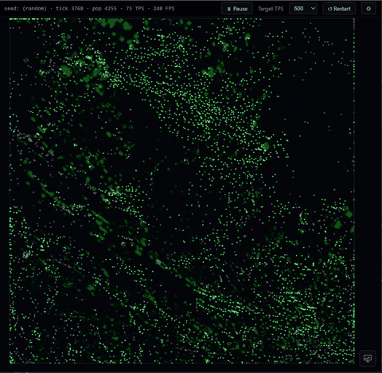
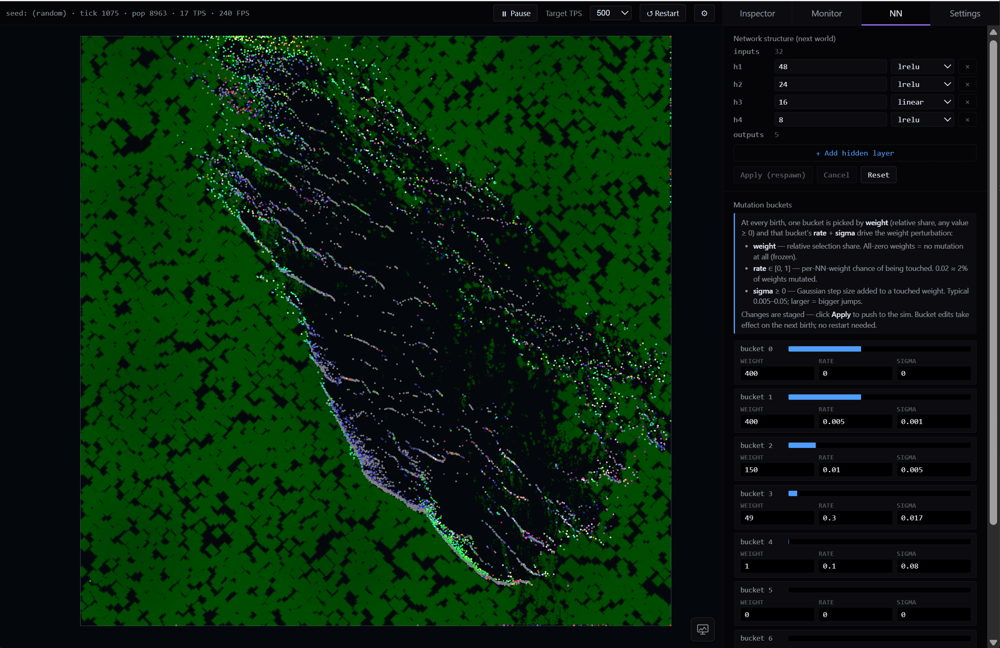
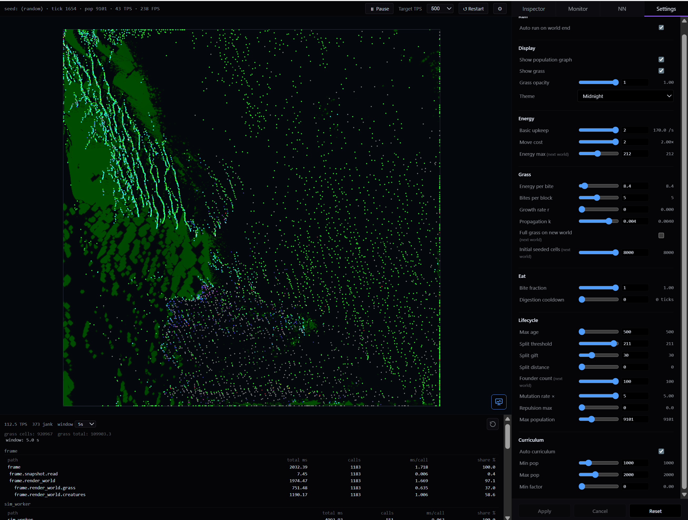
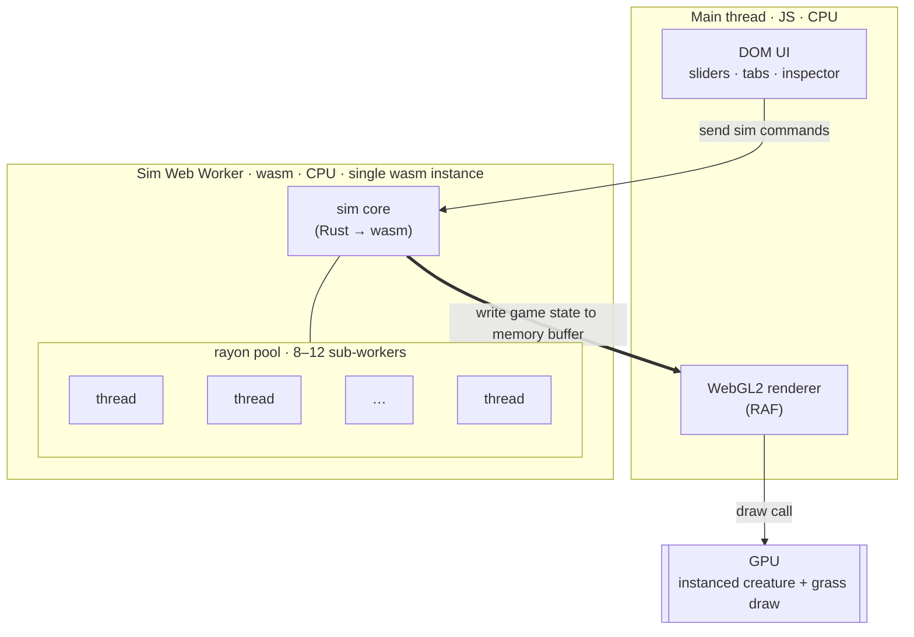

# evosim

A browser-based evolution sandbox. Tiny creatures with tiny neural-network
brains live in a walled world, graze a regrowing grass field, occasionally eat
each other, and split when they have enough energy. Every page load starts a
fresh world — there's no save, no scenario, no goal.

## What you're looking at

Each dot is one creature. Color is a moving average of what it's been doing —
green for grazing, red for biting prey, blue for splitting. The darker
splotches underneath are grass density. The whole thing is a single 1200×1200
world rendered in one instanced WebGL2 draw call.

Brains are a small `32 → 48 → 24 → 5` pyramid with Leaky ReLU hiddens. Inputs
are semantic, not pixels: self state, a short memory vector, four wall
distances, eight sectors of nearby creatures, and eight sectors of grass. The
output picks one of three actions — Graze, Eat, Split — and a heading.

Inheritance is just the weights. A child is a mutated copy of its parent's
brain; over time the population drifts toward whatever works in the current
settings.

## Poking at it

The right-rail tabs let you watch and edit the sim while it runs.

- **Inspector** — click a creature to see its inputs, outputs, age, energy,
  lineage.
- **Monitor** — population graph, action mix, grass stock.
- **NN** — change the layer sizes or mutation buckets and apply to the live
  sim. New births pick up the new shape.
- **Settings** — every tunable in one place: energy economy, grass growth,
  split rules, curriculum pressure, render options.

There's also a profiler panel showing per-phase tick costs, which is mostly
useful when you're changing the sim and want to know what got slower.

## How it's built

- **Rust** compiled to WebAssembly via `wasm-pack`, single crate at the repo
  root. The sim core is regular Rust and runs natively for tests.
- **One wasm instance, in a Web Worker.** The main thread holds no wasm. The
  worker writes snapshots into a shared buffer; the renderer reads the freshest
  slot per frame. Slider changes go the other direction as messages.
- **rayon** + `wasm-bindgen-rayon` parallelise the hot paths inside the worker
  — NN forward across creatures, grass propagation across rows. Needs COOP/COEP
  headers for `SharedArrayBuffer`.
- **TypeScript + Vite + plain DOM** for the shell. No framework. The renderer
  is WebGL2 with instancing.
- **Playwright** for the end-to-end suite covering the worker control path.

The docs tree under [`docs/`](docs/) is the real reference if you want to
understand a specific subsystem. Start at [`docs/index.md`](docs/index.md).

## Performance

Current best on this machine: roughly **8,000 creatures at ~80 ticks per
second**, in the browser.

Each creature carries its own brain (`32 → 48 → 24 → 5`), so a forward pass is
`32·48 + 48·24 + 24·5` ≈ **2,800 multiply-accumulates**. At 8,000 creatures
and 80 tps that comes out to about **1.8 billion MACs per second** for
inference alone — before grass propagation, neighbour queries, energy
bookkeeping, splits, deaths, and snapshot writes.

All of it runs on the CPU, parallelised across 8–12 rayon threads inside the
wasm worker. GPU is the obvious answer for "lots of small matrix math", but it
doesn't fit this workload:

- Every brain holds different weights (inheritance + mutation), so the work is
  thousands of *independent* tiny matmuls, not one big batched one.
- The per-tick budget at 80 tps is ~12 ms. A CPU↔GPU round trip plus readback
  comfortably costs more than that on its own.
- NN outputs feed straight into branchy game logic — eat, split, die, energy
  update — that already lives on the CPU and mutates the same SoA the next
  forward pass will read. Shipping data out to the GPU and back every tick
  would cost more than just doing the math next to it.

So far, threaded wasm over a flat struct-of-arrays layout has been the cheapest
way to keep the whole tick — inputs, NN, decisions, state mutation, snapshot —
in one place.

## Using an agent or are an agent?

Use the [fresh_chat.md](docs/prompts/fresh-chat.md) prompt. It will efficiently catch up your agent on all of the context of my app and answer any questions or help you with whatever you would like.
